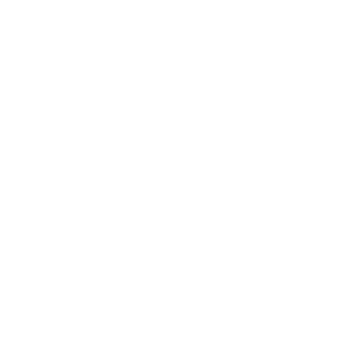

# Licença e privacidade

**Este é um conteúdo não oficial, publicado sob a Licença da Comunidade de
Ordem Paranormal**

*Contém material gerado por inteligência artificial*

---

## O que este app é

**Fichário do Outro Lado** é ferramenta de fã, gratuita, feita por um jogador
para a própria mesa. Não é produto oficial e não tem parceria, aprovação,
supervisão nem endosso de ninguém ligado a Ordem Paranormal.

O universo de Ordem Paranormal — personagens, lugares, história e estética —
é de **Rafael "Cellbit" Lange**, titular exclusivo dos direitos. A licença
usada aqui é a [Licença da Comunidade de Ordem
Paranormal](https://ordemparanormal.com.br/licenca), versão 1.0
(28/06/2026), na categoria *conteúdo de fã gratuito* → **"fichas virtuais
para VTTs"**.

## Como cada condição da Parte 4 é cumprida

| Condição da licença | Onde ela aparece |
|---|---|
| Selo na capa, ≥10% da largura, 100% de opacidade | faixa fixa no topo da tela inicial (`FaixaLicenca`, 13% da largura da tela) e tela **Licença e privacidade** (`lib/screens/licenca_screen.dart`) |
| Frase "conteúdo não oficial…" | na mesma faixa e na tela de licença |
| Aviso de IA | `Contém material gerado por inteligência artificial`, colado no selo, nos dois lugares |
| Aviso de conteúdo sensível | bloco de terror/violência na tela de licença |
| Não usar a marca | app se chama **Fichário do Outro Lado**; nome, ícone, título web e rótulo Android não trazem a marca. Um teste trava isso (`test/regras_op_test.dart`, grupo *licença da comunidade*) |
| Não copiar identidade visual oficial | paleta e tipografia próprias, ícone padrão; nenhuma arte, logo ou projeto gráfico oficial |
| Não reproduzir texto dos livros | ver abaixo |
| LGPD | ver abaixo |
| Não sugerir endosso | dito com todas as letras na tela de licença e aqui |

## O que o app usa do sistema — e o que não usa

**Usa** só a terminologia que a licença libera: os cinco atributos
(Agilidade, Força, Intelecto, Presença e Vigor), Pontos de Vida, Pontos de
Esforço, Sanidade, NEX, Membrana, Outro Lado, os cinco Elementos, Ordo
Realitas, e os **nomes** de perícias, origens, classes, trilhas, patentes,
poderes e rituais. Nomes e números de regra não são texto protegido.

**Não usa**: nenhum parágrafo dos livros, nenhuma arte, mapa, ficha oficial
nem trecho de aventura. Nomes de personagens e lugares do cânone aparecem
no bestiário — a licença libera isso em conteúdo de fã **gratuito**; é o
conteúdo comercial que não pode usá-los. Se um dia este app for cobrado,
esses nomes têm que sair junto com o material gerado por IA.

As descrições de poder e habilidade (`assets/data/origens.json`,
`lib/data/dados_op.dart`) foram **reescritas em notação de mesa** — custo →
efeito → limite de uso, no formato `2 PE → +5 em um teste de Intelecto.`
Nenhuma delas é frase de livro, e um teste reprova qualquer uma que cresça
a ponto de virar prosa.

As 26 origens, as 28 perícias, as 5 patentes e as caixas de características
das classes vêm do **Livro de Regras v1.3**; as 20 origens marcadas com
`"fonte": "Sobrevivendo ao Horror"` e a classe **Sobrevivente** vêm de
*Sobrevivendo ao Horror* (Jambô, 2024). De ambos saem só nome, número e
tabela — a mesma regra de sempre. Quem quiser jogar com o conteúdo do
suplemento precisa do livro na mão; o app marca de onde cada coisa veio
justamente para a mesa saber o que está usando.

O PDF oficial não é lido, embutido nem distribuído pelo app.

**O bestiário** (`assets/bestiario/bestiario.json`, gerado por
`ferramentas/gerar_bestiario.py`) segue a mesma regra, em dois passos. Um
script lê os PDFs **do dono do livro** e extrai só a MECÂNICA de cada
ameaça — VD, PV, Defesa, resistências, atributos, testes e linhas de ataque
— para um arquivo de trabalho local (`ameacas-cru.json`, no `.gitignore`,
nunca distribuído). Depois, o efeito de cada habilidade é **reescrito à
mão** em `ferramentas/notacao_ameacas.py`, no formato `gatilho → efeito
(resistência) · limite`. O que vai para o app é número + notação própria;
nenhum parágrafo dos livros viaja junto. Cada ficha aponta a página onde a
versão oficial está, para quem usa precisar do material oficial na mão.
Táticas e descrições são escritas aqui. Quando existe
versão oficial da ameaça, a ficha **aponta a página do livro** em vez de
transcrevê-la — quem for usar precisa do material oficial na mão. Os
retratos são brasões gerados por código (monograma sobre a cor do
elemento): nenhuma arte oficial entra no app. Nomes de personagens do cânone
aparecem porque a licença libera isso para conteúdo de fã gratuito — o que
ela proíbe é reproduzir os textos, e isso não é feito.

## Seus dados (LGPD)

- **Sem mesa online, nada sai do aparelho.** As fichas ficam no
  armazenamento local (Hive). Não há conta, cadastro, e-mail nem telefone.
- **Entrando numa mesa**, o app faz login **anônimo** no Firebase (um código
  aleatório, sem identificação pessoal) e envia apenas: o nome que você
  digitou, a ficha que você escolheu publicar, suas rolagens e as imagens que
  o mestre mostrar. Quem lê é você e o mestre da sua mesa — as regras em
  `firestore.rules` são o que garante isso.
- **Nada é vendido, cedido ou compartilhado com terceiros.** Sem anúncio, sem
  rastreamento, sem telemetria — a Análise do Firebase está desligada no
  projeto de propósito.
- **Apagar**: *Sair da mesa* remove a sua ficha da mesa; *Encerrar sessão*
  limpa fichas e rolagens da mesa; *Apagar mesa* apaga tudo, inclusive a
  galeria, sem volta.
- Imagens do mural ficam dentro dos documentos do Firestore da mesa — apagar
  a mesa apaga as imagens junto.

## Limites que este app se impõe

- **Continua gratuito.** A licença proíbe **vender** conteúdo que tenha
  material gerado por IA, e parte deste app tem. Cobrar por ele exigiria
  reescrever sem IA e reler a licença vigente na data.
- Não pode virar loja, assinatura, financiamento coletivo nem nada que cobre
  de quem usa.
- Sem casa de aposta, cassino ou jogo de azar (proibição expressa).
- Se a licença for atualizada, o que já foi publicado mantém a versão da
  época; qualquer versão nova do app segue a licença vigente naquele dia.

## Se você for reaproveitar isto

Você pode: publicar a sua versão como conteúdo de fã, desde que mantenha o
selo, os avisos e as regras acima, e não use a marca. Você **não** pode:
vender, encher de texto dos livros, ou dar a entender que é oficial.

Dúvida sobre um caso específico: leia a licença inteira em
<https://ordemparanormal.com.br/licenca>. Em caso de conflito de
interpretação, quem decide é o titular dos direitos.
